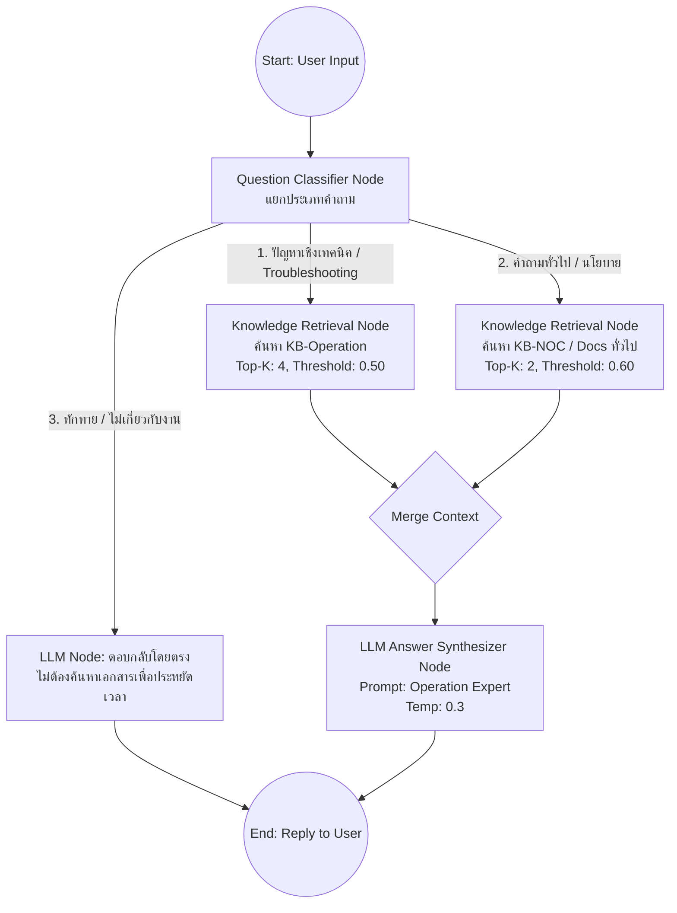

# แผนสถาปัตยกรรม Dify: DSL & Chatflow (ผ่านการ Scrutinize รอบที่ 3)

เอกสารนี้สรุปแผนการย้ายจากระบบการรันสคริปต์แก้ฐานข้อมูล (DB Scripting) ไปสู่ระบบ **Configuration as Code (DSL)** และการอัปเกรดความฉลาดของบอทด้วย **Chatflow (Agentic RAG)** ซึ่งถูกกลั่นกรองความเสี่ยงและความซับซ้อนแล้ว

---

## 1. ผลการ Scrutinize รอบที่ 3 (Refining the "Out of the box" idea)

| ระดับ | สิ่งที่พบ (Finding) | แนวทางแก้ไขในแผนนี้ (Suggested Change) |
|---|---|---|
| ⚠️ **Major** | **Over-engineering**: การเปลี่ยนบอททั้งหมดเป็น Chatflow ซับซ้อนเกินความจำเป็น เพราะ NOC และ Customer Bot มีขอบเขตคำถามแคบและตรงไปตรงมา | **Hybrid Approach**: ใช้ Chatflow *เฉพาะกับ Operation Bot* (ที่ต้องแก้ปัญหาซับซ้อน) ส่วน NOC & Customer Bot ใช้ Basic Chatbot ควบคุมผ่าน DSL YAML |
| 🚨 **Blocker** | **App Type Migration**: Dify ไม่สามารถแปลง Basic Chatbot เป็น Chatflow ได้ตรงๆ ต้องสร้าง App ใหม่ | แจ้งทีมว่าต้องสร้าง App "Operation Chatflow" ใหม่ใน Dify (จะได้ API Endpoint/Key ใหม่) ส่วนตัวเก่าอาจเก็บไว้เป็น Backup |
| 💡 **Nit** | **การจัดระเบียบไฟล์ DSL**: ไฟล์ YAML อาจปนกันถ้าไม่แยกประเภท | แยกชื่อไฟล์ให้ชัดเจน เช่น `operation-bot.chatflow.yml` และ `noc-bot.chat.yml` |

---

## 2. แผนสถาปัตยกรรมใหม่ (Hybrid App Architecture)

### 2.1 บอทระดับพื้นฐาน (NOC Bot & Customer FAQ Bot)
- **ประเภท (Mode)**: Basic Chatbot
- **การตั้งค่า (DSL)**: ส่งออกเป็น `noc-bot.chat.yml` และ `customer-bot.chat.yml` เก็บในโฟลเดอร์ `dify/apps/`
- **ตรรกะ**: ยึดตาม System Prompt ตรงไปตรงมา ค้นหาข้อมูลจาก 1 Dataset ต่อ 1 บอท

### 2.2 บอทระดับสูง (Operation Bot)
- **ประเภท (Mode)**: Advanced Chatflow (Agentic RAG)
- **การตั้งค่า (DSL)**: ส่งออกเป็น `operation-bot.chatflow.yml`
- **ตรรกะการทำงาน (ดู Diagram ด้านล่าง)**:

## 3. Workflow Diagram (Operation Bot Chatflow)

---

## 4. ขั้นตอนการลงมือปฏิบัติ (Execution Steps)

1. **เตรียมไฟล์ DSL สำหรับ Basic Bots**:
   - เข้า Dify UI -> ปรับจูน NOC & Customer Bot (Top-K 4, Threshold 0.5) -> กด Export DSL YAML
   - นำไฟล์มาเก็บไว้ที่ `chatbot/dify/apps/`
2. **สร้าง Operation Chatflow**:
   - เข้า Dify UI -> สร้าง App ใหม่แบบ **Advanced Chat**
   - ลากโหนด (Nodes) จัดทำตาม Workflow Diagram ด้านบน
   - ทดสอบจนเสถียร -> Export DSL เป็น `operation-bot.chatflow.yml`
3. **ยกเลิกการใช้สคริปต์ Database**:
   - ลบสคริปต์ `scripts/tuning/tune_dify_all.py` เดิมทิ้ง หรือติดป้าย [DEPRECATED] เพื่อป้องกันใครเผลอไปรันจนฐานข้อมูลพัง
